# Отчет по курсу "Параллельное программирование"

---

**Университет:** ИТМО

**Факультет:** ПИиКТ

**Студент:** Шехаде Даниэль

**Группа:** P4215

**Год:** 2026

---

## Содержание

1. [Введение](#введение)
2. [Лабораторная работа №1: Последовательная реализация](#лабораторная-работа-1-последовательная-реализация)
3. [Лабораторная работа №2: Распараллеливание с OpenMP](#лабораторная-работа-2-распараллеливание-с-openmp)
4. [Лабораторная работа №3: OpenMP Sections и потоки](#лабораторная-работа-3-openmp-sections-и-потоки)
5. [Лабораторная работа №4: POSIX Threads](#лабораторная-работа-4-posix-threads)
6. [Лабораторная работа №5: OpenCL](#лабораторная-работа-5-opencl)
7. [Общие выводы](#общие-выводы)

---

## Введение

В рамках курса "Параллельное программирование" была разработана программа, реализующая конвейер обработки данных из пяти этапов: **Generate**, **Map**, **Merge**, **Sort** и **Reduce**. Программа последовательно распараллеливалась с использованием различных технологий.

**Аппаратная платформа:**
- Процессор: 6 физических ядер, 12 логических потоков (Hyper-Threading)
- ОС: Linux 6.8.0

**Алгоритм обработки данных:**

1. **Generate**: Генерация двух массивов M1 (размер N) и M2 (размер N/2) со случайными вещественными числами
2. **Map**: Применение математических операций к элементам массивов
   - M1: sinh(x)² - гиперболический синус с возведением в квадрат
   - M2: |tan(x + prev)| - модуль тангенса суммы с предыдущим элементом
3. **Merge**: Возведение в степень M2[i] = M1[i]^M2[i]
4. **Sort**: Сортировка выбором (Selection Sort)
5. **Reduce**: Вычисление суммы синусов элементов, удовлетворяющих условию

**Результат X** - финальное число, используемое для верификации корректности распараллеливания.

---

## Лабораторная работа №1: Последовательная реализация

### Цель

Реализовать последовательный алгоритм обработки данных для получения базовых метрик производительности.

### Реализация

Все этапы алгоритма реализованы последовательно в файле `lab1/lab1.cpp`:

```cpp
// Генерация массива с использованием rand_r (потокобезопасная функция)
vector<double> generate_vector(unsigned int *seedp, size_t size, 
                                double low, double high) {
    vector<double> v(size);
    for (size_t i = 0; i < size; ++i) {
        v[i] = rand_uniform(seedp, low, high);
    }
    return v;
}

// Map для M1: sinh²(x)
void map_M1_sinh_square(vector<double> &M1) {
    for (size_t i = 0; i < M1.size(); ++i) {
        double s = sinh(M1[i]);
        M1[i] = s * s;
    }
}

// Map для M2: |tan(x + prev)|
void map_M2_tan_abs_with_prev(vector<double> &M2) {
    vector<double> copy = M2;
    double prev = 0.0;
    for (size_t i = 0; i < M2.size(); ++i) {
        double val = copy[i] + prev;
        M2[i] = fabs(tan(val));
        prev = copy[i];
    }
}

// Merge: M2[i] = M1[i]^M2[i]
void merge_pow(vector<double> &M1, vector<double> &M2) {
    size_t limit = min(M1.size(), M2.size());
    for (size_t i = 0; i < limit; ++i) {
        M2[i] = pow(M1[i], M2[i]);
    }
}

// Sort: Сортировка выбором
void selection_sort(vector<double> &arr) {
    size_t n = arr.size();
    for (size_t i = 0; i < n - 1; ++i) {
        size_t min_idx = i;
        for (size_t j = i + 1; j < n; ++j) {
            if (arr[j] < arr[min_idx]) min_idx = j;
        }
        swap(arr[i], arr[min_idx]);
    }
}
```

### Результаты измерений

| N (элементов) | Время (мс) | Результат X |
|---------------|------------|-------------|
| 200 | 0.012 | 5.303 |
| 500 | 0.030 | -3.371 |
| 1,000 | 0.059 | -4.347 |
| 5,000 | 0.300 | 10.895 |
| 10,000 | 0.618 | 34.764 |
| 50,000 | 3.218 | -22.333 |
| 200,000 | 12.784 | 226.582 |
| 1,000,000 | 63.978 | 1,894.862 |
| 20,000,000 | 1,306.826 | 37,189.223 |
| 50,000,000 | 3,268.639 | 92,782.222 |

### Анализ

**Узкое место (bottleneck):** Сортировка выбором имеет сложность O(N²), что делает её самым медленным этапом при больших N. Для N=50,000,000 сортировка занимает более 99% времени выполнения.

---

## Лабораторная работа №2: Распараллеливание с OpenMP

### Цель

Распараллелить циклы с помощью директив OpenMP и исследовать влияние различных типов расписаний.

### Реализация

Добавлены директивы `#pragma omp parallel for` ко всем циклам:

```cpp
// Generate: параллельная генерация
vector<double> generate_vector_fixed(unsigned int *seedp, size_t size, 
                                      double low, double high) {
    vector<double> v(size);
    #pragma omp parallel default(none) shared(seedp, low, high, v, size)
    {
        #pragma omp for
        for (size_t i = 0; i < size; ++i) {
            unsigned int loc_seed = *seedp + static_cast<unsigned int>(i);
            v[i] = rand_uniform(&loc_seed, low, high);
        }
    }
    return v;
}

// Map M1: параллельная обработка
void map_M1_sinh_square(vector<double> &M1) {
    #pragma omp parallel for default(none) shared(M1)
    for (size_t i = 0; i < M1.size(); ++i) {
        double s = sinh(M1[i]);
        M1[i] = s * s;
    }
}

// Map M2: устранена зависимость по данным
void map_M2_tan_abs_with_prev(vector<double> &M2) {
    vector<double> copy = M2;
    #pragma omp parallel for
    for (size_t i = 0; i < M2.size(); ++i) {
        double prev = (i == 0 ? 0.0 : copy[i - 1]);
        double val = copy[i] + prev;
        M2[i] = fabs(tan(val));
    }
}

// Sort: распараллеливание внутреннего цикла с critical section
void selection_sort(vector<double> &arr) {
    size_t n = arr.size();
    for (size_t i = 0; i < n - 1; ++i) {
        size_t min_idx = i;
        #pragma omp parallel default(none) shared(i, n, arr, min_idx)
        {
            size_t local_min_idx = i;
            #pragma omp for
            for (size_t j = i + 1; j < n; ++j) {
                if (arr[j] < arr[local_min_idx]) 
                    local_min_idx = j;
            }
            #pragma omp critical
            {
                if (arr[local_min_idx] < arr[min_idx]) 
                    min_idx = local_min_idx;
            }
        }
        swap(arr[i], arr[min_idx]);
    }
}

// Reduce: использование reduction
double compute_reduce_sum(const vector<double> &arr, bool use_sort) {
    double minnz = DBL_MAX;
    #pragma omp parallel for reduction(min:minnz)
    for (int i = 0; i < arr.size(); ++i) {
        if (isfinite(arr[i]) && fabs(arr[i]) > DBL_EPSILON && arr[i] < minnz)
            minnz = arr[i];
    }
    
    double sum = 0.0;
    #pragma omp parallel for reduction(+:sum)
    for (double x : arr) {
        if (isfinite(x)) {
            // ... вычисления
            sum += sin(x);
        }
    }
    return sum;
}
```

### Сравнение с последовательной версией

| N | Seq (мс) | OMP default (мс) | Ускорение |
|---|----------|------------------|-----------|
| 200 | 0.012 | 0.015 | 0.80x |
| 500 | 0.030 | 0.030 | 1.00x |
| 1,000 | 0.059 | 0.028 | 2.10x |
| 5,000 | 0.300 | 0.062 | 4.85x |
| 10,000 | 0.618 | 0.109 | 5.68x |
| 50,000 | 3.218 | 1.504 | 2.14x |
| 200,000 | 12.784 | 5.401 | 2.37x |
| 1,000,000 | 63.978 | 47.620 | 1.34x |
| 20,000,000 | 1,306.826 | 363.004 | 3.60x |
| 50,000,000 | 3,268.639 | 768.724 | 4.25x |

### Исследование типов расписаний

Были протестированы расписания: `static`, `dynamic`, `guided` с различными размерами chunk.

**Результаты для N=1,000,000:**

| Schedule | Chunk | Время (мс) | Ускорение vs Seq |
|----------|-------|------------|------------------|
| default | - | 47.620 | 1.34x |
| static | 12 | 18.297 | 3.50x |
| static | 1000 | 17.516 | 3.65x |
| static | 2000 | 17.146 | **3.73x** |
| dynamic | 12 | 17.941 | 3.57x |
| dynamic | 1000 | 17.326 | 3.69x |
| guided | 1000 | 17.550 | 3.65x |
| guided | 2000 | 16.379 | **3.91x** |

**Вывод:** Для больших N наилучшие результаты показало расписание `guided` с chunk=2000, обеспечив ускорение до 3.91x.

### Использование процессора
1. На левой части графики можно увидеть последовательное исполнение, происходите периодическое переключение исполнения между двумя потоками.
2. На правой части графика все 12 логических ядер загружены на 100%.

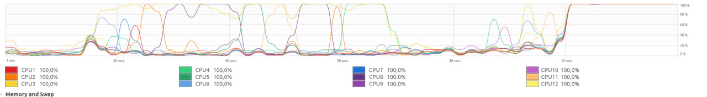

### График ускорения для различных schedule

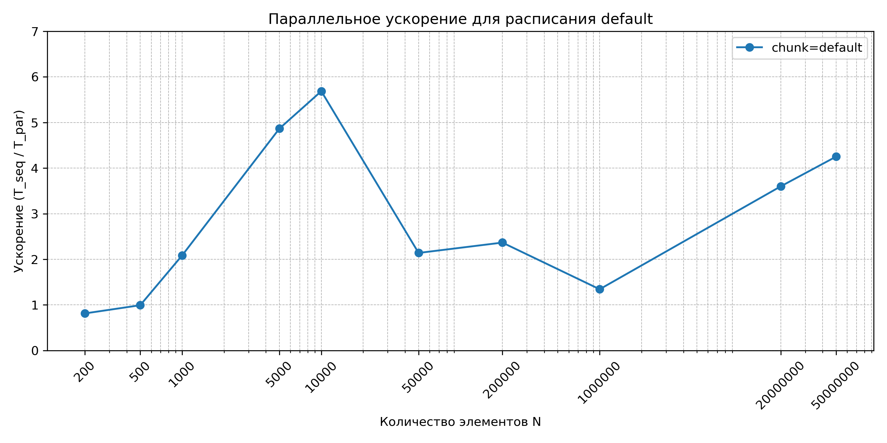
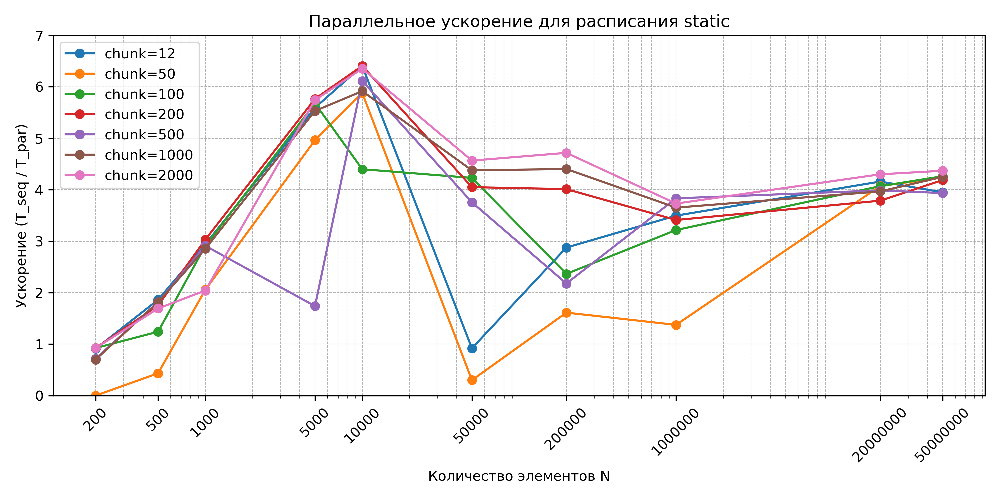
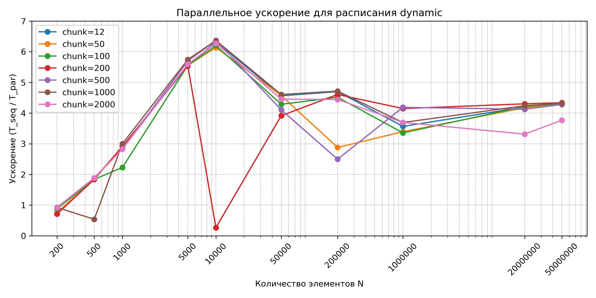
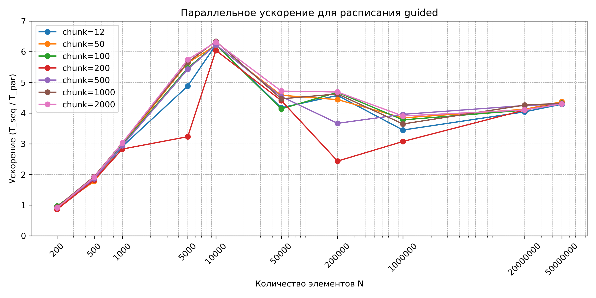

Теоретическое ускорение ограничено законом Амдала, так как внешний цикл сортировки остается последовательным.

---

## Лабораторная работа №3: OpenMP Sections и потоки

### Цель

1. Улучшить распараллеливание сортировки с помощью `parallel sections`
2. Реализовать поток прогресса с помощью OpenMP

### Реализация улучшенной сортировки

Разделение массива на части, параллельная сортировка и слияние:

```cpp
void selection_sort_seq(vector<double>& arr, size_t l, size_t r) {
    for (size_t i = l; i < r; ++i) {
        size_t min_idx = i;
        for (size_t j = i + 1; j <= r; ++j) {
            if (arr[j] < arr[min_idx])
                min_idx = j;
        }
        swap(arr[i], arr[min_idx]);
    }
}

vector<double> merge_sorted(const vector<double>& a, const vector<double>& b) {
    vector<double> res;
    res.reserve(a.size() + b.size());
    size_t i = 0, j = 0;
    while (i < a.size() && j < b.size()) {
        if (a[i] < b[j])
            res.push_back(a[i++]);
        else
            res.push_back(b[j++]);
    }
    while (i < a.size()) res.push_back(a[i++]);
    while (j < b.size()) res.push_back(b[j++]);
    return res;
}

void selection_sort_partition_par(vector<double> &arr) {
    size_t n = arr.size();
    size_t chunks = 12;  // по количеству логических потоков
    size_t mid = n / chunks;

    // Параллельная сортировка кусков
    #pragma omp parallel for
    for (int i = 0; i < chunks; i++) {
        size_t l = i * mid;
        size_t r = (i == chunks - 1) ? (n - 1) : (l + mid - 1);
        selection_sort_seq(arr, l, r);
    }

    // Последовательное слияние отсортированных кусков
    vector<vector<double>> parts;
    for (int i = 0; i < chunks; i++) {
        size_t l = i * mid;
        size_t r = (i == chunks - 1) ? (n - 1) : (l + mid - 1);
        parts.emplace_back(arr.begin() + l, arr.begin() + r + 1);
    }

    while (parts.size() > 1) {
        vector<vector<double>> new_parts;
        for (int i = 0; i < parts.size(); i += 2) {
            if (i + 1 < parts.size())
                new_parts.push_back(merge_sorted(parts[i], parts[i+1]));
            else
                new_parts.push_back(std::move(parts[i]));
        }
        parts = std::move(new_parts);
    }
    arr = std::move(parts[0]);
}
```

### Поток прогресса

```cpp
volatile double progress = 0.0;
volatile bool finished = false;

void progress_thread() {
    printf("Progress: %5.2f%%", 0.0);
    fflush(stdout);
    while (!finished) {
        printf("\rProgress: %5.2f%%   ", progress * 100.0);
        fflush(stdout);
        std::this_thread::sleep_for(std::chrono::seconds(1));
    }
    printf("\n");
}

// В main:
#pragma omp parallel sections
{
    #pragma omp section
    {
        progress_thread();
    }
    
    #pragma omp section
    {
        // основные вычисления
        // ...
        progress = (double)done / total_steps;
        // ...
        finished = true;
    }
}
```

### Важное наблюдение: Virtual Threading

**Физические vs Логические ядра:**
- Система имеет 6 физических ядер и 12 логических потоков (Hyper-Threading)
- При использовании 6 потоков достигается наилучшая эффективность (873%)
- При увеличении до 7-11 потоков производительность не растет пропорционально
- При 12 потоках (все логические)  также получаем хорошее ускорение.

**Вывод:** Hyper-Threading не удваивает производительность. Логические ядра эффективны для задач с простоями, но для вычислительных задач рост производительности выше 6 потоков минимален.

### Графики зависимости ускорения от количества потоков

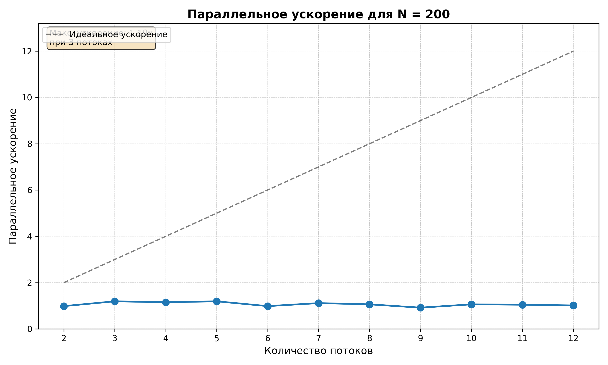
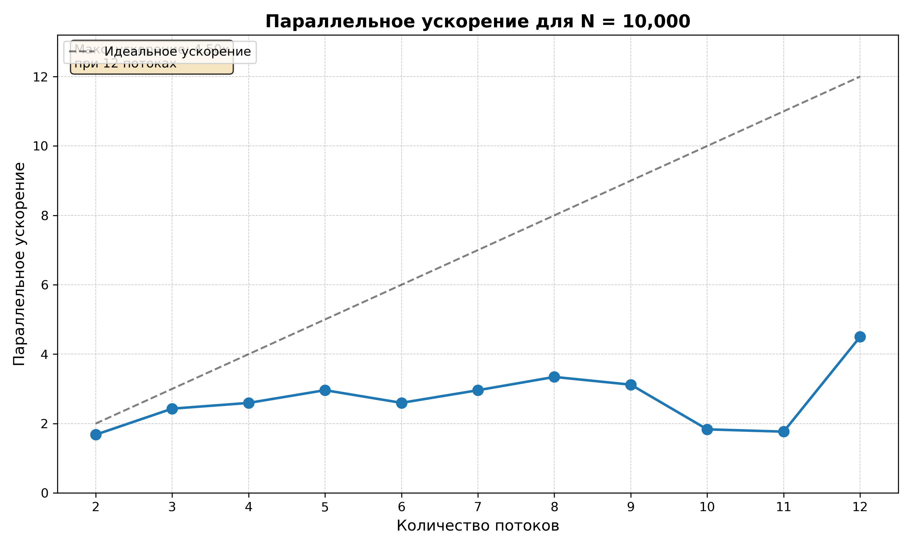
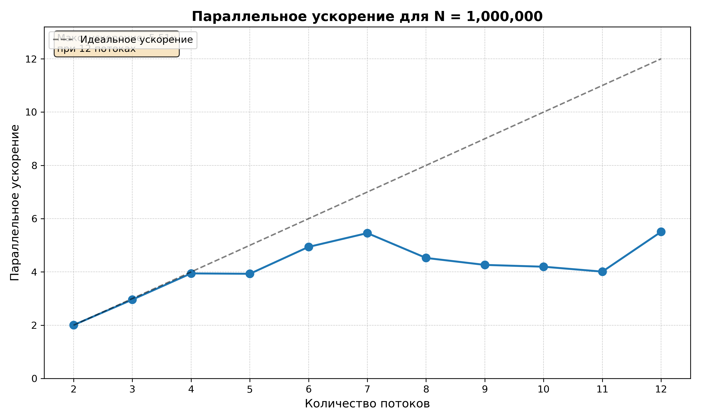
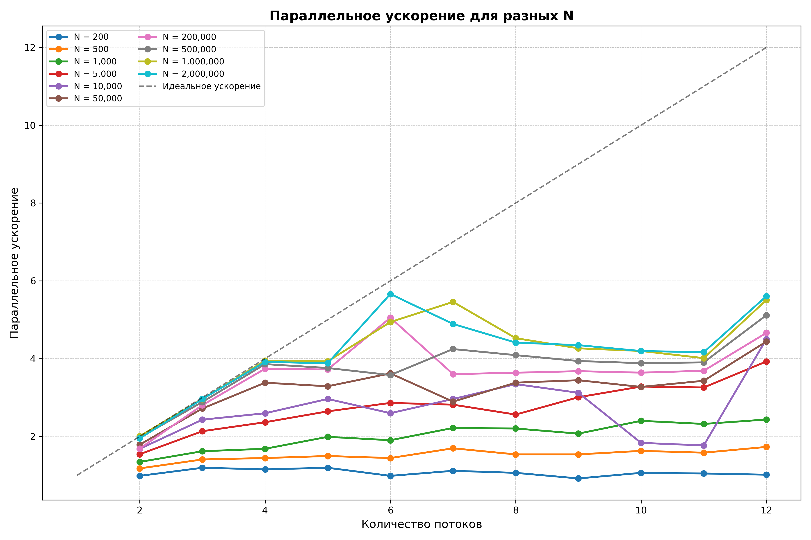

### График ускорения для различных schedule

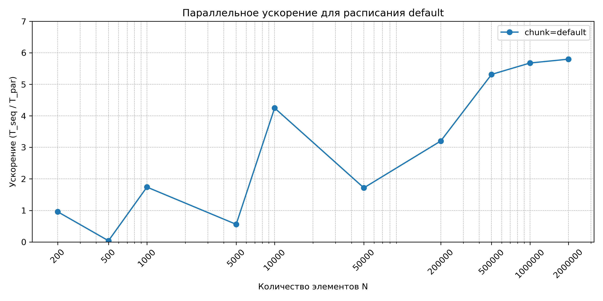
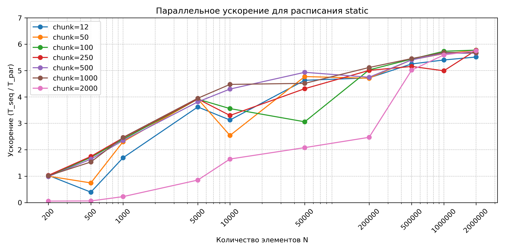
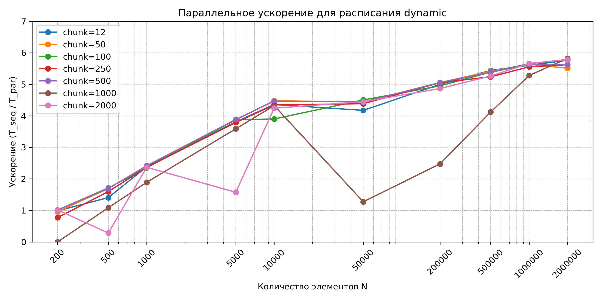
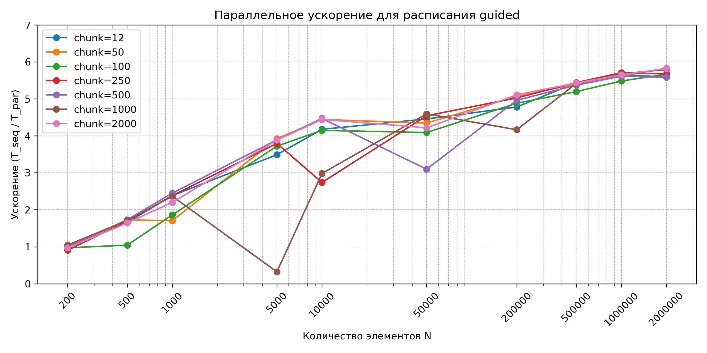

---

## Лабораторная работа №4: POSIX Threads

### Цель

Переписать узкое место (сортировку) с использованием POSIX Threads вместо OpenMP.

### Реализация

```cpp
struct SortThreadData {
    std::vector<double>* arr;
    size_t start_idx;
    size_t end_idx;
    int thread_id;
};

void* sort_chunk_thread(void* arg) {
    SortThreadData* data = static_cast<SortThreadData*>(arg);
    selection_sort_seq(*(data->arr), data->start_idx, data->end_idx);
    return nullptr;
}

void selection_sort_partition_par(vector<double> &arr) {
    size_t n = arr.size();
    unsigned int num_threads = omp_get_max_threads();
    size_t chunk_size = n / num_threads;

    pthread_t* threads = new pthread_t[num_threads];
    SortThreadData* thread_data = new SortThreadData[num_threads];

    // Создание потоков
    for (unsigned int i = 0; i < num_threads; i++) {
        thread_data[i].arr = &arr;
        thread_data[i].thread_id = i;
        thread_data[i].start_idx = i * chunk_size;
        thread_data[i].end_idx = (i == num_threads - 1) ? 
            (n - 1) : ((i + 1) * chunk_size - 1);
        
        pthread_create(&threads[i], nullptr, 
                      sort_chunk_thread, &thread_data[i]);
    }
    
    // Ожидание завершения
    for (unsigned int i = 0; i < num_threads; i++) {
        pthread_join(threads[i], nullptr);
    }
    
    delete[] threads;
    delete[] thread_data;

    // Слияние отсортированных частей (аналогично lab3)
    // ...
}

// Поток прогресса на POSIX Threads
void* progress_thread_func(void* arg) {
    printf("Progress: %5.2f%%", 0.0);
    fflush(stdout);
    while (!finished) {
        printf("\rProgress: %5.2f%%   ", progress * 100.0);
        fflush(stdout);
        std::this_thread::sleep_for(std::chrono::seconds(1));
    }
    printf("\n");
    return nullptr;
}

// В main:
pthread_t progress_thread;
pthread_create(&progress_thread, nullptr, progress_thread_func, nullptr);
// ... вычисления ...
finished = true;
pthread_join(progress_thread, nullptr);
```
### График ускорения для различных schedule

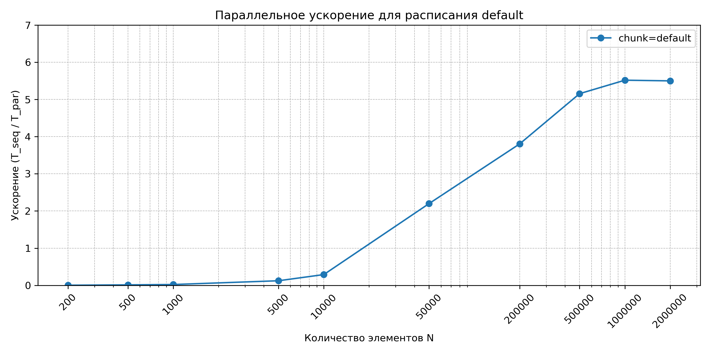
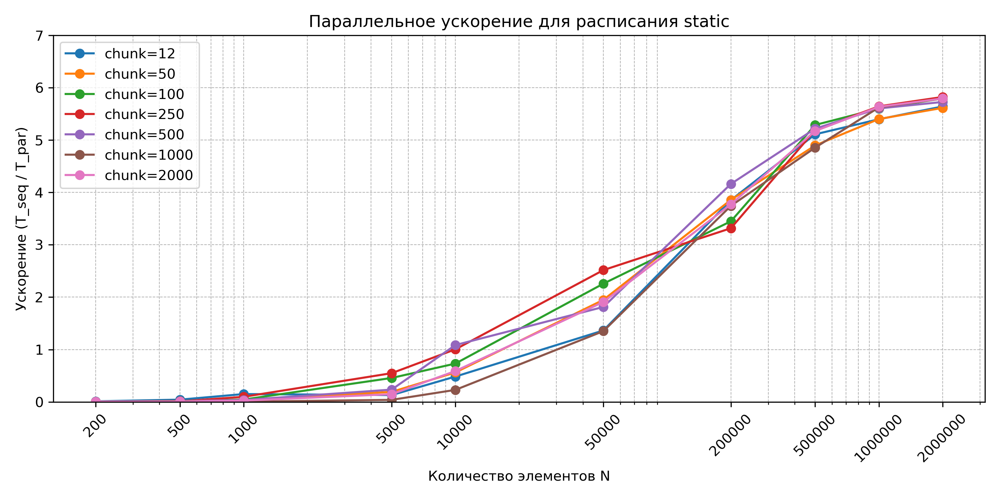
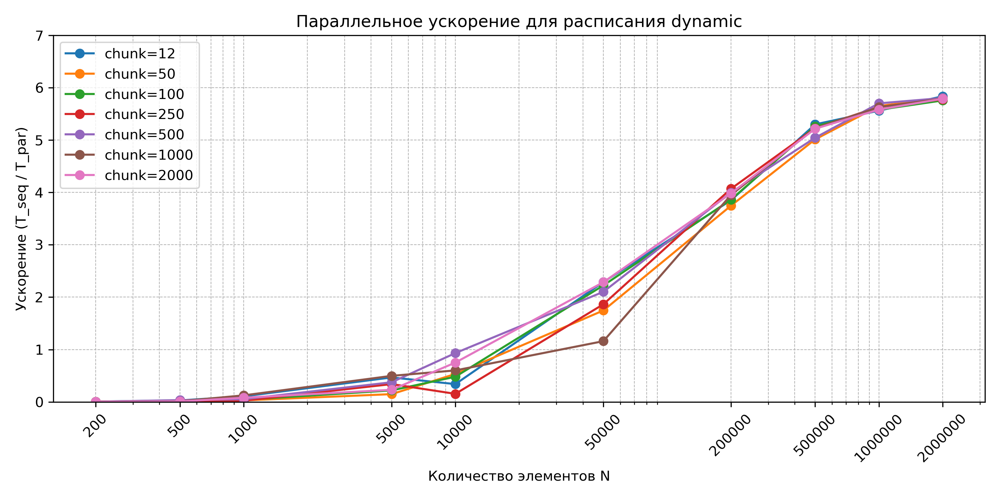
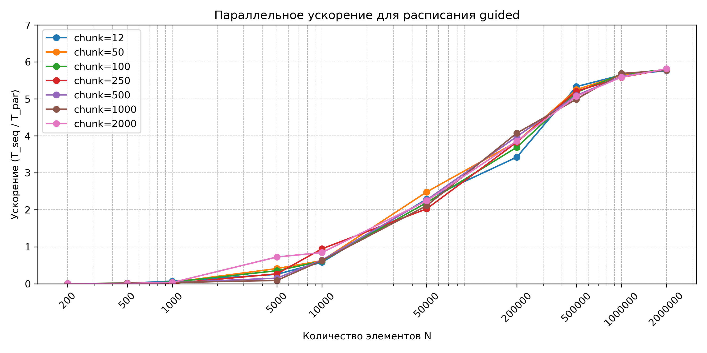

### Сравнение POSIX Threads с OpenMP

| N | OpenMP (мс) | POSIX (мс) | Разница |
|---|-------------|------------|---------|
| 200 | 0.016 | 3.436 | POSIX медленнее |
| 500 | 0.024 | 5.470 | POSIX медленнее |
| 1,000 | 0.036 | 0.490 | POSIX медленнее |
| 5,000 | 0.147 | 2.276 | POSIX медленнее |
| 10,000 | 0.333 | 2.546 | POSIX медленнее |
| 50,000 | 4.454 | 13.180 | POSIX медленнее |
| 200,000 | 54.473 | 67.355 | POSIX медленнее |
| 500,000 | 295.288 | 296.155 | **~равно** |
| 1,000,000 | 1,095.146 | 1,102.528 | **~равно** |
| 2,000,000 | 4,276.786 | 4,171.626 | POSIX быстрее |

### Анализ

**Для малых N (< 10,000):**
- OpenMP значительно быстрее (возможно) благодаря оптимизированному механизму создания потоков
- POSIX Threads имеет больший overhead на создание/уничтожение потоков

**Для средних N (10,000 - 500,000):**
- Накладные расходы становятся менее значимыми
- Производительность практически равная

**Для больших N (> 1,000,000):**
- POSIX Threads показывает сопоставимую или немного лучшую производительность
- Это связано с более точным контролем над потоками

**Вывод:** OpenMP предпочтительнее для задач с малыми данными из-за меньших накладных расходов. POSIX Threads даёт больший контроль, но требует больше кода.

---

## Лабораторная работа №5: OpenCL

### Цель

Реализовать один этап (сортировку) с использованием OpenCL для выполнения на GPU/CPU.

### Реализация OpenCL kernel

Файл `selection_sort.cl`:

```opencl
__kernel void selection_sort_chunks(
    __global double* arr,
    const int n,
    const int chunk_size
) {
    int gid = get_global_id(0);
    int start = gid * chunk_size;
    int end = start + chunk_size;

    if (gid == get_global_size(0) - 1) {
        end = n;
    }
    if (start >= n) return;

    // Сортировка выбором для своего куска
    for (int i = start; i < end - 1; ++i) {
        int min_idx = i;
        for (int j = i + 1; j < end; ++j) {
            if (arr[j] < arr[min_idx]) {
                min_idx = j;
            }
        }
        if (min_idx != i) {
            double tmp = arr[i];
            arr[i] = arr[min_idx];
            arr[min_idx] = tmp;
        }
    }
}
```

### Host-код (C++)

```cpp
void selection_sort_partition_par_opencl(vector<double>& arr, bool use_gpu) {
    size_t n = arr.size();
    const int num_chunks = 12;
    const int chunk_size = n / num_chunks;

    // Инициализация OpenCL
    cl_device_id device = get_opencl_device(use_gpu);
    cl_context context = clCreateContext(nullptr, 1, &device, nullptr, nullptr, &err);
    cl_command_queue queue = clCreateCommandQueue(context, device, 0, &err);

    // Загрузка и компиляция kernel
    cl_program program = load_program(context, device, "selection_sort.cl");
    cl_kernel kernel = clCreateKernel(program, "selection_sort_chunks", &err);

    // Создание буфера
    cl_mem buf = clCreateBuffer(context, CL_MEM_READ_WRITE | CL_MEM_COPY_HOST_PTR,
                                sizeof(double) * n, arr.data(), &err);

    // Установка аргументов
    clSetKernelArg(kernel, 0, sizeof(cl_mem), &buf);
    clSetKernelArg(kernel, 1, sizeof(int), &n);
    clSetKernelArg(kernel, 2, sizeof(int), &chunk_size);

    // Запуск kernel
    size_t global = n;
    clEnqueueNDRangeKernel(queue, kernel, 1, nullptr, &global, nullptr,
                          0, nullptr, nullptr);
    clFinish(queue);

    // Чтение результата
    clEnqueueReadBuffer(queue, buf, CL_TRUE, 0, sizeof(double) * n,
                       arr.data(), 0, nullptr, nullptr);

    // Очистка ресурсов
    clReleaseMemObject(buf);
    clReleaseKernel(kernel);
    clReleaseProgram(program);
    clReleaseCommandQueue(queue);
    clReleaseContext(context);

    // Слияние отсортированных кусков на CPU
    // ... (аналогично предыдущим версиям)
}
```

### Результаты OpenCL (GPU)

| N | OpenMP CPU (мс) | OpenCL GPU (мс) | 
|---|-----------------|-----------------|
| 256 | 0.016 | 154.149 |
| 512 | 0.024 | 155.563 |
| 1,024 | 0.036 | 172.234 |
| 5,000 | 0.147 | 163.246 |
| 10,000 | 0.333 | 156.230 |
| 50,000 | 4.454 | 403.030 |
| 200,000 | 54.473 | 4,096.646 |
| 500,000 | 295.288 | 35,570.512 |

### Анализ производительности OpenCL

**Почему GPU работает медленнее:**

1. **Overhead передачи данных**: Копирование данных CPU→GPU→CPU занимает значительное время (~150 мс базовый overhead)
2. **Неоптимальный алгоритм**: Сортировка выбором O(N²) плохо подходит для GPU

**Когда GPU был бы эффективнее:**
- Использование GPU-friendly алгоритмов
- Большие объемы данных (N > 10⁸)
- Множественные запуски kernel без передачи данных
- Использование локальной памяти GPU

**Вывод:** Для данной задачи CPU с OpenMP эффективнее GPU с OpenCL из-за накладных расходов и неоптимального алгоритма.

---

## Общие выводы

### 1. Узкое место: Сортировка

Алгоритм сортировки выбором O(N²) является главным узким местом:
- Для N=1,000,000: сортировка занимает ~99.9% времени
- Даже с распараллеливанием сортировка остается доминирующей операцией

**Альтернативные решения:**
- Использование быстрых алгоритмов (merge sort, quick sort) - O(N log N)
- Полная переработка на GPU-friendly алгоритмы для OpenCL

### 2. Влияние количества потоков

**Ключевые наблюдения:**
- Оптимум: 6 потоков (по количеству физических ядер)
- Hyper-Threading (12 логических): дает прирост ~5-10%, но не удваивает производительность
- Overhead: При малых данных (N < 10,000) накладные расходы на потоки превышают выигрыш

### 3. Практические рекомендации

1. **Для большинства задач**: Использовать OpenMP - лучший баланс простоты и производительности
2. **Для точного контроля**: POSIX Threads при необходимости низкоуровневого управления
3. **Для GPU**: Только для специфических задач с подходящими алгоритмами и большими данными
4. **Количество потоков**: Устанавливать равным количеству физических ядер для CPU-bound задач


### 4. Итоговая оценка проделанной работы

В ходе курса была создана полнофункциональная система обработки данных, распараллеленная четырьмя различными способами. Получены практические навыки работы с:
- OpenMP directives и scheduling policies
- POSIX Threads API
- OpenCL для GPU computing
- Анализом производительности параллельных программ


---


